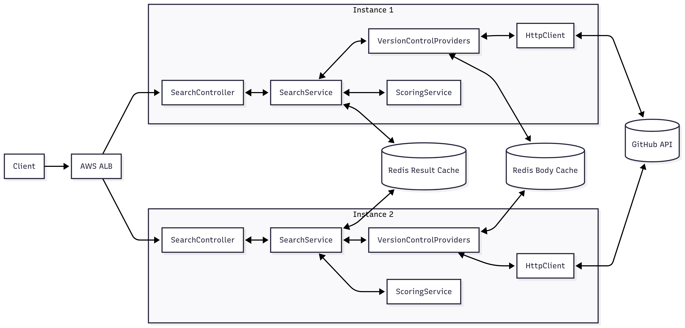

## Version Control System Repository Scorer

Discover version control system repositories via the corresponding search APIs, compute a normalized quality/popularity score for each repository, and return scored results through a simple REST API.

The service is built with NestJS and includes configuration management, robust HTTP client with retries/timeouts, Redis-backed caching, structured logging, and basic metrics hooks.

### 1. What this repo does

- **Fetch repositories** from different providers using the Search API with required filters: language and created date
- **Score each repository** using a weighted model:
  - Stars (default weight 0.5)
  - Forks (default weight 0.3)
  - Recency of last update with a half-life decay (90 days) (default weight 0.2)
- **Normalize popularity** using log scaling with a P95 cap to avoid outlier domination
- **Cache** upstream provider responses and scored query results in Redis for performance and rate-limit friendliness
- **Expose** a typed REST endpoint and auto-generated Swagger UI for exploration

#### 1.1 High-level architecture

<a href="docs/system-design.png"></a>

**Note**: The diagram reflects a production-style setup. This repo currently runs as a single-instance, Dockerized service; there is no AWS ALB or Kubernetes deployment included. It can be adapted for Kubernetes or placed behind an ALB with minimal additional implementation.

- `version control system providers` module: Builds queries, calls different VCS providers API with retry/timeout, handles rate-limit and API errors, caches raw bodies. (Currently only Github provider is implemented, Gitlab is initialised)
- `scoring` module: Applies normalization and weights to compute a final score in [0, 1]
- `search` module: Orchestrates version control system provider search + scoring, and caches scored responses
- foundational services (in `src/core`): Config, HTTP Client (Axios), Redis cache, Logging, Metrics, Error filter

### 2. API

Base URL: `http://localhost:3000`

- Global prefix: `/api`
- Versioning: `/v1`
- Swagger UI: `/docs` (served without the global prefix)

#### 2.1 Search scored repositories

GET `/api/v1/search/repositories/scored`

Query parameters:

- `language` (string, required): Filter by primary language
- `createdFrom` (string, required): ISO date `YYYY-MM-DD`
- `perPage` (integer, 1..100, optional, default 20)
- `page` (integer, >=1, optional, default 1)

For simplicity, the default sorting is based on the number of stars in descending order. The response is returned in descending order of the calculated popularity score

Pagination and ordering

- Pagination: `perPage` controls page size (1..100), `page` starts from 1. Providers may cap Search API results differently. Github caps it to the first 1000 items, so the maximum useful page is `Math.floor(1000 / perPage)`.
- Tip: For deeper browsing, narrow the result set using filters (e.g., `createdFrom`) or paginate by time windows.

Example request with pagination:

```bash
curl "http://localhost:3000/api/v1/search/repositories/scored?language=TypeScript&createdFrom=2025-05-01&perPage=10&page=1"
```

Response shape (shortened):

```json
{
  "totalCount": 1234,
  "incompleteResults": false,
  "items": [
    {
      "score": 0.82345,
      "breakdown": {
        "normalizedStars": 0.91,
        "normalizedForks": 0.78,
        "recencyScore": 0.66,
        "weights": { "stars": 0.5, "forks": 0.3, "recency": 0.2 }
      },
      "repository": {
        "id": 123,
        "full_name": "owner/repo",
        "html_url": "https://github.com/owner/repo",
        "stargazers_count": 12345,
        "forks_count": 2345,
        "updated_at": "2025-08-01T12:00:00Z",
        "language": "TypeScript"
      }
    }
  ]
}
```

Error handling:

- 400 on invalid query constraints (e.g., GitHub query length > 256, too many boolean operators)
- 429 when VCS rate limit is hit (respects `Retry-After`/`X-RateLimit-Remaining`)
- 502/503 for upstream failures/timeouts

### 3. Running the project

#### 3.1 Prerequisites

- Node.js 20+
- Redis 7+
- (Optional but recommended) GitHub Personal Access Token to increase rate limits from 10 to 30 in a minute

#### 3.2 Environment variables

You can set these via a `.env` file (auto-loaded) or process env. Defaults are shown.

**Recommendation**: Prefer a `.env` file for clarity and reproducibility. The configuration includes sensible defaults, so the service can start and run without any environment file. If a GitHub token will be used, it is recommended to set it via the `.env` file.

| Variable                        | Required | Default                  | Description                                     |
| ------------------------------- | -------- | ------------------------ | ----------------------------------------------- |
| `PORT`                          | no       | `3000`                   | HTTP port                                       |
| `NODE_ENV`                      | no       | `local`                  | Environment name                                |
| `REDIS_HOST`                    | no       | `127.0.0.1`              | Redis host                                      |
| `REDIS_PORT`                    | no       | `6379`                   | Redis port                                      |
| `REDIS_PASSWORD`                | no       | `""`                     | Redis password                                  |
| `REDIS_DB`                      | no       | `0`                      | Redis database index                            |
| `REDIS_TLS_ENABLED`             | no       | `false`                  | Enable TLS for Redis connection                 |
| `REDIS_TLS_REJECT_UNAUTHORIZED` | no       | `true`                   | Reject unauthorized TLS certs                   |
| `REDIS_ENABLE_READY_CHECK`      | no       | `true`                   | Enable ready check on Redis client              |
| `REDIS_MAX_RETRIES_PER_REQUEST` | no       | `1`                      | ioredis max retries per request                 |
| `GITHUB_API_BASE_URL`           | no       | `https://api.github.com` | GitHub API base URL                             |
| `GITHUB_API_VERSION`            | no       | `2022-11-28`             | GitHub API version header                       |
| `GITHUB_TOKEN`                  | no       | `""`                     | GitHub token (PAT) for higher rate limits       |
| `GITHUB_TIMEOUT_MS`             | no       | `5000`                   | HTTP timeout for GitHub requests                |
| `CACHE_SEARCH_TTL_MS`           | no       | `300000`                 | TTL (ms) for cached raw GitHub search responses |
| `CACHE_SCORED_TTL_MS`           | no       | `600000`                 | TTL (ms) for cached scored search responses     |

Tip: Copy the provided example file and adjust as needed:

```bash
cp .env.example .env
```

#### 3.3 Run locally

1. Install dependencies

```bash
npm ci
```

2. Start Redis with docker

```bash
docker compose up -d redis
```

3. (Optional) Export a GitHub token

```bash
export GITHUB_TOKEN=ghp_your_token_here
```

4. Start the API

```bash
npm run start:dev
```

5. Explore

- Swagger UI: [http://localhost:3000/docs](http://localhost:3000/docs)
- Example endpoint: [http://localhost:3000/api/v1/search/repositories/scored](http://localhost:3000/api/v1/search/repositories/scored)

#### 3.4 Run with Docker Compose

This will build the app image and start both the app and Redis.

```bash
docker compose up --build
```

View logs (app only or all services):

```bash
docker compose logs -f app
# or
docker compose logs -f
```

Bring everything down:

```bash
docker compose down
```

### 4. Scoring methodology (details)

- Weights (defaults): `stars=0.5`, `forks=0.3`, `recency=0.2`
- Popularity normalization:
  - Apply `log1p` to stars and forks
  - Use the 95th percentile of logged values as denominator
  - Clamp normalized values to [0, 1]
- Recency:
  - Half-life model with 90 days; more recent updates score higher
- Final score = `starsNormalized*starsWeight + forksNormalized*forksWeight + recency*recencyWeight`, clamped to [0, 1]

### 5. Continuous Integration (CI)

This repository uses GitHub Actions to run lint, build, and test workflows on every push and pull request.

- Workflow file: `.github/workflows/ci.yml`
- Jobs: ESLint (no warnings), TypeScript build, and Jest unit tests

### 6. Development

Common scripts:

- `npm run start:dev` run with watch mode
- `npm run build`  compile to `dist/`
- `npm test`  unit tests (Jest)
- `npm run lint`  lint and fix

### 7. Future improvements


Given time constraints, the following items were not implemented:

- Metrics & Observability
 - Prometheus metrics endpoint and dashboards such as Grafana
 - OpenTelemetry traces and log correlation
- Kubernetes & Deployment
 - Helm chart / Kustomize manifests
 - Liveness/readiness probes, HPA
 - Config via ConfigMaps/Secrets
 - Redis as a managed service
- API and Performance
 - User auth logic to prevent abusive usage
 - Version control providers could be extended. Currently, only GitHub is implemented, and GitLab is only initialized.
 - Dynamic scoring module, with individual score calculators that can be combined to aggregate weighted scores.
 - Store scroing module weights in DB, making it easier to adjust values.
 - Rate limiting and request quotas per client
- Platform & DX
 - CD enhancements

---

Made with NestJS. See `/docs` for interactive API.
